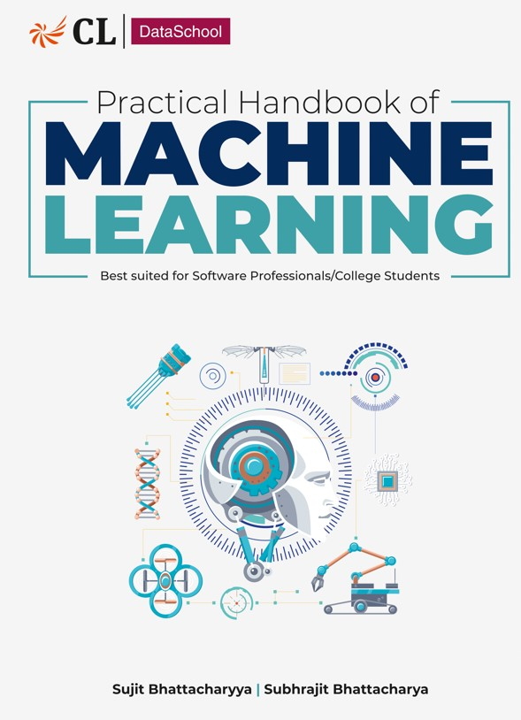
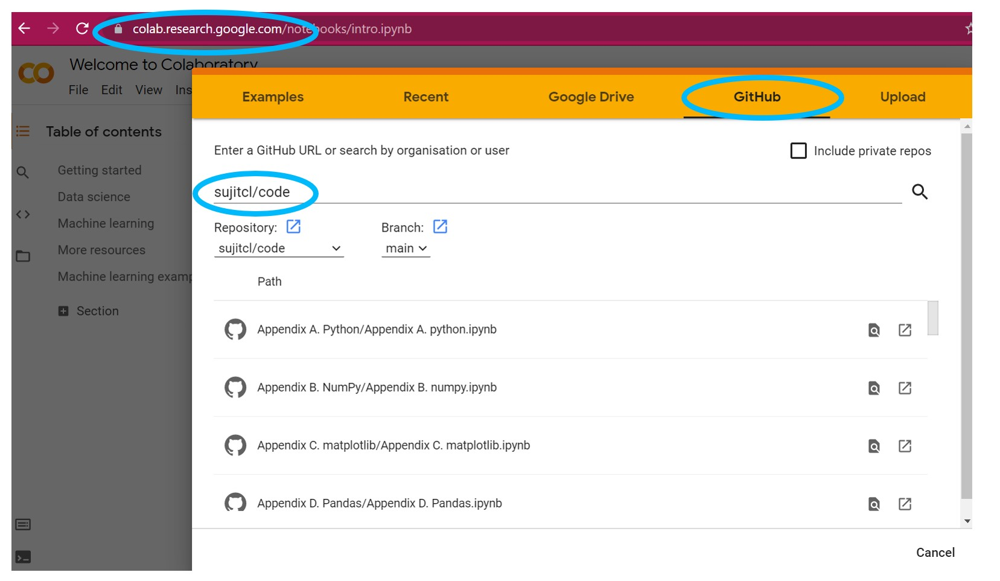

# How to Run the ML Example Code

To access the book code examples, please use [Google Colab](https://colab.research.google.com/)

Open Colab and go to File->Open Notebook

Search for the github repository **sujitcl/code** to access these demonstration notebooks

